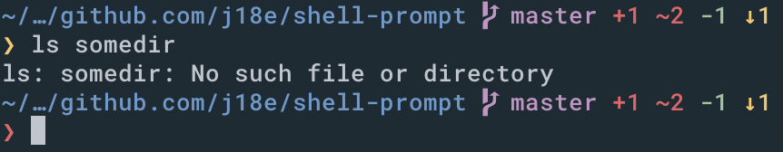

# Shell Prompt
A lightning fast terminal prompt including detailed Git status info


## Installation
```
sh -c $(curl -fsSL https://github.com/j18e/shell-prompt/raw/master/install.sh)
```
alternatively, if you have golang set up:
```
go get github.com/j18e/shell-prompt
```

## Usage
### Bash
Add the following to your `.bashrc`:
```
function _update_ps1() {
    PS1="$(shell-prompt -exit-code $?)"
}

PROMPT_COMMAND="_update_ps1; $PROMPT_COMMAND"
```

### ZSH
Add the following to your `.zshrc` (you should be using oh-my-zsh):
```
which shell-prompt >> /dev/null || go install github.com/j18e/shell-prompt
PROMPT='$(shell-prompt -exit-code $? -zsh)'
```
